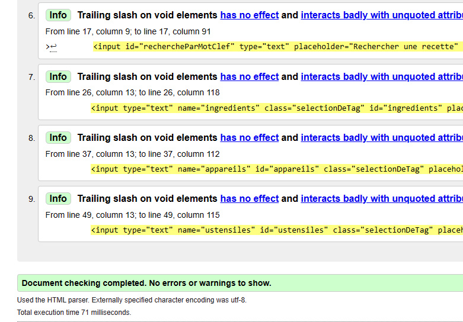
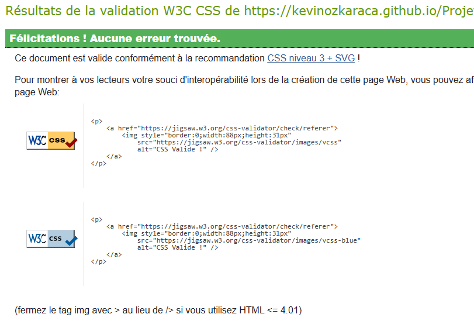

# Les petits plats

## 🔴 Visiter le site : https://kevinozkaraca.github.io/Projet_PetitsPlats/

### La validation W3C

## HTML

<p align="center">
<br>

</p>

## CSS

<p align="center">
<br>

</p>

## Les deux branches du projet

premiere branche : https://github.com/kevinozkaraca/Projet_PetitsPlats/blob/algo1/fonctions/filtreGeneralDesRecettes.js
deuxieme branche : https://github.com/kevinozkaraca/Projet_PetitsPlats/blob/algo2/fonctions/filtreGeneralDesRecettes.js

## Projet

- Implémenter un système de recherches de recettes rapide
- Respecter le design à la lettre
- Réaliser deux algorithmes de recherche

## Objectifs

- Implémenter l'interface
- Valider le code par W3C
- Faire deux versions de recherche :
  - une version utilisant les boucles natives (while, for...)
  - une version en programmation fonctionnelle avec les méthodes de l'objet array (foreach, filter, map, reduce).
- faire un schéma (sur le site : https://app.diagrams.net/), ou "algorigramme", pour chacune des propositions (les deux implémentations peuvent avoir le même algorigramme)
- utiliser 2 branches différentes sur Git pour chaque implémentation
- tester les performances de chaque implémentation (sur : https://jsben.ch/)
- tester uniquement la recherche principale (pas besoin d’utiliser les filtres)
- Ajouter les résultats à la fiche d’investigation de fonctionnalité que tu auras rédigée
- Terminer le document par la recommandation d’algorithme à garder suite à ton analyse et tes tests.

## Livrables

- Une fiche d’investigation de fonctionnalité sur l’algorithme de recherche (format PDF). Vous y intégrerez le choix de l'algorithme définitif en comparaison à l’autre algorithme de recherche développé.
- Un fichier au format TXT contenant le lien vers votre code sur GitHub comprenant les deux branches avec les deux solutions différentes pour la recherche.

## Fonction Filter

En JavaScript, la fonction filter est une méthode intégrée pour les tableaux. Elle permet de filtrer les éléments d'un tableau en fonction d'un critère spécifié et renvoie un nouveau tableau contenant uniquement les éléments qui satisfont ce critère.

La syntaxe générale de la fonction filter en JavaScript est la suivante :

```javascript
array.filter(callback(element, index, array), thisArg);
```

où array est le tableau sur lequel la fonction filter est appliquée, callback est une fonction qui prend trois arguments (l'élément courant, l'index de l'élément courant et le tableau lui-même) et renvoie true ou false en fonction du critère, et thisArg (facultatif) est la valeur à utiliser comme this lorsque la fonction callback est exécutée.

Voici un exemple pour illustrer son fonctionnement :

```javascript
// Fonction de filtrage pour les nombres pairs
function estPair(nombre) {
  return nombre % 2 === 0;
}

// Tableau de nombres
var nombres = [1, 2, 3, 4, 5, 6, 7, 8, 9, 10];

// Filtrage des nombres pairs
var nombresPairs = nombres.filter(estPair);

// Affichage du résultat
console.log(nombresPairs); // Résultat : [2, 4, 6, 8, 10]
```

Dans cet exemple, nous avons défini une fonction estPair qui vérifie si un nombre est pair en utilisant l'opérateur modulo (%). Ensuite, nous avons appliqué la méthode filter au tableau nombres en passant estPair comme argument. La méthode filter renvoie un nouveau tableau contenant uniquement les éléments pour lesquels la fonction estPair renvoie true.

La fonction filter peut également être utilisée avec une fonction fléchée (arrow function) pour un code plus concis. Voici un exemple similaire au précédent en utilisant une fonction fléchée pour filtrer les mots d'un tableau en fonction de leur longueur :

```javascript
// Tableau de mots
var mots = ["chat", "chien", "oiseau", "souris", "elephant"];

// Filtrage des mots de longueur supérieure à 4
var motsLongueurSup4 = mots.filter((mot) => mot.length > 4);

// Affichage du résultat
console.log(motsLongueurSup4); // Résultat : ['chien', 'oiseau', 'souris', 'elephant']
```

Dans cet exemple, nous avons utilisé une fonction fléchée pour définir le critère de filtrage, c'est-à-dire que nous avons filtré les mots dont la longueur est supérieure à 4.

## Fonction Map

En JavaScript, la fonction map() est une méthode intégrée pour les tableaux. Elle permet de créer un nouveau tableau en appliquant une transformation à chaque élément du tableau d'origine.

La syntaxe générale de la fonction map() en JavaScript est la suivante :

```javascript
array.map(callback(element, index, array), thisArg);
```

où array est le tableau sur lequel la fonction map() est appliquée, callback est une fonction qui prend trois arguments (l'élément courant, l'index de l'élément courant et le tableau lui-même) et renvoie la valeur transformée, et thisArg (facultatif) est la valeur à utiliser comme this lorsque la fonction callback est exécutée.

Voici un exemple pour illustrer son fonctionnement :

```javascript
// Fonction de transformation pour doubler les nombres
function doubler(nombre) {
  return nombre * 2;
}

// Tableau de nombres
var nombres = [1, 2, 3, 4, 5];

// Transformation des nombres en les doublant
var nombresDoubles = nombres.map(doubler);

// Affichage du résultat
console.log(nombresDoubles); // Résultat : [2, 4, 6, 8, 10]
```

Dans cet exemple, nous avons défini une fonction doubler qui multiplie un nombre par 2. Ensuite, nous avons appliqué la méthode map() au tableau nombres en passant doubler comme argument. La méthode map() renvoie un nouveau tableau contenant les valeurs transformées, dans ce cas les nombres doublés.

La fonction map() peut également être utilisée avec une fonction fléchée (arrow function) pour un code plus concis. Voici un exemple similaire au précédent en utilisant une fonction fléchée pour transformer les mots d'un tableau en leur longueur :

```javascript
// Tableau de mots
var mots = ["chat", "chien", "oiseau"];

// Transformation des mots en leur longueur
var longueurs = mots.map((mot) => mot.length);

// Affichage du résultat
console.log(longueurs); // Résultat : [4, 5, 6]
```

Dans cet exemple, nous avons utilisé une fonction fléchée pour définir la transformation, c'est-à-dire que nous avons transformé chaque mot en sa longueur en utilisant mot.length.
